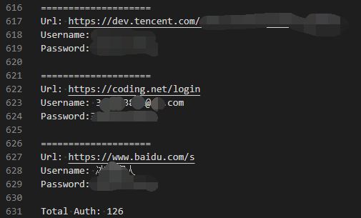

# HackChrome

[](https://travis-ci.com/cckuailong/HackChrome)

[English ReadMe](https://github.com/cckuailong/HackChrome/blob/master/README.md) || 
[中文 ReadMe](https://github.com/cckuailong/HackChrome/blob/master/README_zh.md)

从Chrome中获取自动保存的用户名密码

## 影响Chrome版本

全版本

## 平台

Windows

## 使用

- 下载 exe 文件 [下载地址](https://github.com/cckuailong/HackChrome/releases/tag/v0.1)

- 打开 cmd 或者 powershell

- 运行

```
Hackone.exe > res.txt
```

## 效果截图



## 原理

- version < 80

Chrome的用户名密码存储在"Login Data"文件中。

密码是加密的，但我们可以使用 "Crypt32.dll" 中的 "CryptUnprotectData" 函数来解密密码。

最终，我们获取到了明文的用户名密码。

- version > 80

算法整体基于 "version < 80"的算法，然而现在利用一个 master key和nounce，使用 AES-GCM 加密密码。

master key 在 "Local State" 文件中，可以使用上面提到的 "CryptUnprotectData" 函数解密。

nounce 则在密文的头部。

因此，我们可以解密出明文密码。

- 结果合并操作

如果刚刚升级Chrome到v80，之前保存的密码和之后保存的密码存储加密方式将会不同，所以HackChrome将两组结果
以某种算法聚合起来，得到最终的用户名密码数组。
